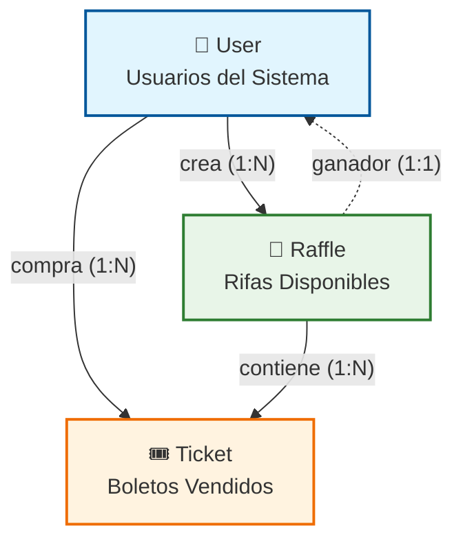
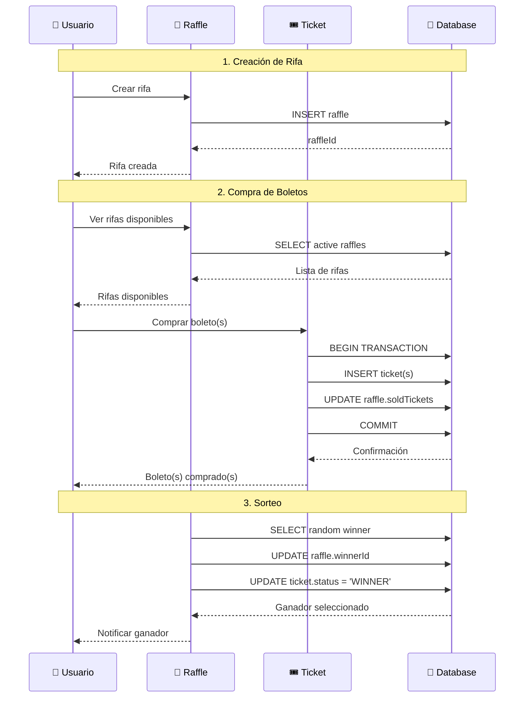

# Modelo de Datos Core - Flujo de Negocio

## Diagrama Simplificado del Core Business



## Flujo de Datos Principal



## Métricas de Negocio por Tabla

### 📊 **User (Usuarios)**
```sql
-- Usuarios activos
SELECT COUNT(*) FROM users WHERE isActive = true;

-- Usuarios verificados
SELECT COUNT(*) FROM users WHERE documentVerified = true;

-- Distribución por país
SELECT country, COUNT(*) FROM users GROUP BY country;
```

### 🎫 **Raffle (Rifas)**
```sql
-- Rifas activas
SELECT COUNT(*) FROM raffles WHERE isActive = true AND endDate > NOW();

-- Revenue total
SELECT SUM(soldTickets * ticketPrice) FROM raffles;

-- Tasa de éxito (rifas completadas)
SELECT 
  COUNT(CASE WHEN soldTickets = maxTickets THEN 1 END) * 100.0 / COUNT(*) 
FROM raffles;
```

### 🎟️ **Ticket (Boletos)**
```sql
-- Boletos vendidos hoy
SELECT COUNT(*) FROM tickets WHERE DATE(purchaseDate) = CURRENT_DATE;

-- Usuario más activo
SELECT buyerId, COUNT(*) as tickets_bought 
FROM tickets 
GROUP BY buyerId 
ORDER BY tickets_bought DESC 
LIMIT 1;

-- Ingresos por rifa
SELECT 
  r.title,
  COUNT(t.id) * r.ticketPrice as revenue
FROM raffles r
JOIN tickets t ON r.id = t.raffleId
GROUP BY r.id, r.title, r.ticketPrice;
```

## Puntos Críticos de Performance

### 🔥 **Hot Spots**
1. **Compra simultánea de boletos** → Contention en `tickets` table
2. **Consulta de números disponibles** → JOIN pesado entre `raffles` y `tickets`
3. **Conteo de boletos vendidos** → Agregación costosa en tiempo real

### ⚡ **Optimizaciones Aplicadas**

#### 1. **Campo Desnormalizado**
```sql
-- En lugar de COUNT(*)
SELECT maxTickets - soldTickets as available 
FROM raffles WHERE id = ?;
```

#### 2. **Índices Estratégicos**
```sql
-- Búsqueda rápida de boletos por rifa
CREATE INDEX idx_tickets_raffle_number ON tickets(raffleId, number);

-- Consultas de usuario
CREATE INDEX idx_tickets_buyer_date ON tickets(buyerId, purchaseDate);

-- Rifas activas
CREATE INDEX idx_raffles_active ON raffles(isActive, endDate) 
WHERE isActive = true;
```

#### 3. **Constraints de Negocio**
```sql
-- Prevenir sobreventa
CONSTRAINT check_sold_tickets 
CHECK (soldTickets <= maxTickets)

-- Números únicos por rifa
UNIQUE CONSTRAINT unique_raffle_number (raffleId, number)
```

## Escalabilidad Futura

### 📈 **Crecimiento Esperado**
- **Users**: 10K → 100K usuarios
- **Raffles**: 100 → 1K rifas activas simultáneas  
- **Tickets**: 1M → 100M boletos/año

### 🛠 **Estrategias de Escalamiento**

#### **Particionamiento Horizontal**
```sql
-- Por fecha
CREATE TABLE tickets_2024_q1 PARTITION OF tickets 
FOR VALUES FROM ('2024-01-01') TO ('2024-04-01');

-- Por raffle_id
CREATE TABLE tickets_shard_1 PARTITION OF tickets 
FOR VALUES WITH (MODULUS 4, REMAINDER 0);
```

#### **Read Replicas**
- **Master**: Escrituras (compras, creaciones)
- **Slaves**: Lecturas (consultas, reportes)

#### **Caching Layer**
```typescript
// Redis para datos calientes
const availableNumbers = await redis.smembers(`raffle:${id}:available`);
const raffleStats = await redis.hgetall(`raffle:${id}:stats`);
```

### 🎯 **KPIs a Monitorear**
- **Query time** < 100ms (95th percentile)
- **Transaction throughput** > 1000 TPS
- **Table size** < 10M registros por partición
- **Index hit ratio** > 99%