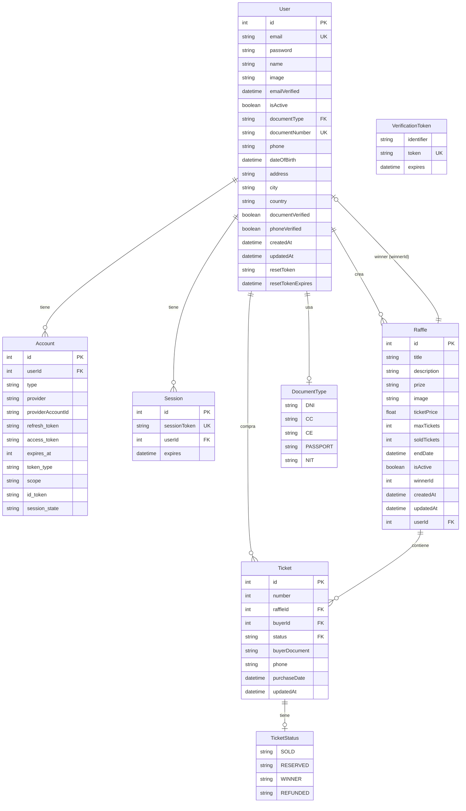

# Modelo de Datos - Raffler

## Diagrama de Entidad-Relación



## Descripción de Tablas

### 🧑‍💼 **User (Usuarios)**
**Tabla principal** que almacena toda la información de usuarios del sistema.

| Campo | Tipo | Descripción |
|-------|------|-------------|
| `id` | INT (PK) | Identificador único autoincremental |
| `email` | STRING (UK) | Email único del usuario |
| `password` | STRING | Hash de la contraseña |
| `name` | STRING | Nombre completo del usuario |
| `image` | STRING | URL del avatar del usuario |
| `emailVerified` | DATETIME | Fecha de verificación del email |
| `isActive` | BOOLEAN | Estado activo del usuario |
| `documentType` | ENUM | Tipo de documento (DNI, CC, CE, PASSPORT, NIT) |
| `documentNumber` | STRING (UK) | Número único del documento |
| `phone` | STRING | Teléfono de contacto |
| `dateOfBirth` | DATETIME | Fecha de nacimiento |
| `address` | STRING | Dirección física |
| `city` | STRING | Ciudad de residencia |
| `country` | STRING | País de residencia |
| `documentVerified` | BOOLEAN | Si el documento fue verificado |
| `phoneVerified` | BOOLEAN | Si el teléfono fue verificado |

### 🎫 **Raffle (Rifas)**
**Tabla central** que define las rifas disponibles.

| Campo | Tipo | Descripción |
|-------|------|-------------|
| `id` | INT (PK) | Identificador único de la rifa |
| `title` | STRING | Título de la rifa |
| `description` | STRING | Descripción detallada |
| `prize` | STRING | Descripción del premio |
| `image` | STRING | URL de la imagen del premio |
| `ticketPrice` | FLOAT | Precio por boleto |
| `maxTickets` | INT | Número máximo de boletos |
| `soldTickets` | INT | Contador de boletos vendidos |
| `endDate` | DATETIME | Fecha de finalización |
| `isActive` | BOOLEAN | Estado activo de la rifa |
| `winnerId` | INT (FK) | ID del usuario ganador |
| `userId` | INT (FK) | ID del creador de la rifa |

### 🎟️ **Ticket (Boletos)**
**Tabla de alta concurrencia** que almacena todos los boletos vendidos.

| Campo | Tipo | Descripción |
|-------|------|-------------|
| `id` | INT (PK) | Identificador único del boleto |
| `number` | INT | Número del boleto en la rifa |
| `raffleId` | INT (FK) | ID de la rifa |
| `buyerId` | INT (FK) | ID del comprador |
| `status` | ENUM | Estado del boleto (SOLD, RESERVED, WINNER, REFUNDED) |
| `buyerDocument` | STRING | Documento del comprador para verificación |
| `buyerPhone` | STRING | Teléfono del comprador |

### 🔐 **Account & Session (Autenticación)**
**Tablas de NextAuth.js** para manejo de sesiones y proveedores OAuth.

### 📊 **Enums**
- **DocumentType**: DNI, CC, CE, PASSPORT, NIT
- **TicketStatus**: SOLD, RESERVED, WINNER, REFUNDED

## Relaciones Clave

### **1:N (Uno a Muchos)**
- `User` → `Raffle` (Un usuario puede crear múltiples rifas)
- `User` → `Ticket` (Un usuario puede comprar múltiples boletos)
- `Raffle` → `Ticket` (Una rifa puede tener múltiples boletos)
- `User` → `Account` (Un usuario puede tener múltiples cuentas OAuth)
- `User` → `Session` (Un usuario puede tener múltiples sesiones)

### **1:1 (Uno a Uno)**
- `Raffle` → `User` (winnerId) (Una rifa puede tener un ganador)

### **Índices Importantes**
```sql
-- Índices únicos
UNIQUE (email)
UNIQUE (documentNumber)
UNIQUE (sessionToken)
UNIQUE (token) -- VerificationToken
UNIQUE (raffleId, number) -- Un número por rifa

-- Índices compuestos
INDEX (provider, providerAccountId)
INDEX (identifier, token)
```

## Consideraciones de Escalabilidad

### 🔥 **Tabla Crítica: Tickets**
- **Alto volumen** de inserts durante compras
- **Queries frecuentes** por raffleId
- **Candidata para particionamiento** por fecha o raffleId

### 📈 **Optimizaciones Implementadas**
- `soldTickets` desnormalizado en `Raffle` para evitar COUNT(*)
- Índices únicos para prevenir duplicados
- Campos calculados para mejorar performance

### 🚀 **Próximas Optimizaciones**
- Particionamiento de tabla `Tickets`
- Cache de números disponibles en Redis
- Separación de rifas activas/completadas